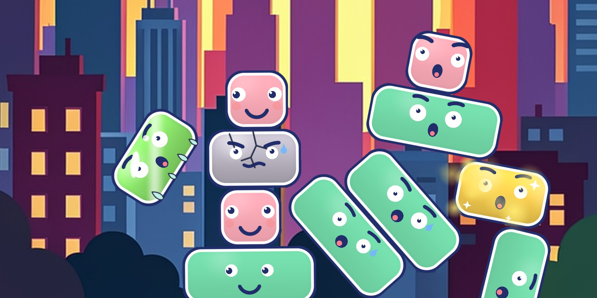
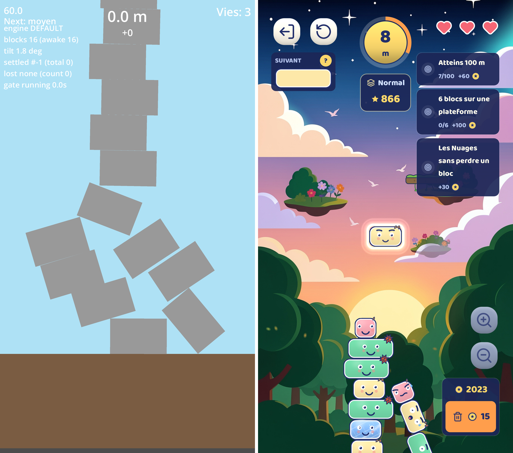
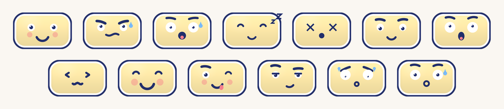

# Un jeu sur le Play Store sans être développeur

*Product designer, j'ai conçu, développé et publié un jeu de physique Android en pilotant Claude Code. Récit en quatre épisodes. Celui-ci raconte les deux premières semaines : ce que la machine abat à une vitesse déraisonnable, et ce qu'elle ne décidera jamais à votre place.*

---

Le 10 juin au soir, le dépôt de Wobblox était vide. Deux jours plus tard, une tour de blocs tenait debout sur un émulateur Android et je pouvais jouer. Quarante-huit heures pour rendre jouable un jeu de physique.

Je précise tout de suite le détail qui change la lecture : je ne suis pas développeur. Je suis product designer depuis huit ans. Mon quotidien, ce sont des outils métier pour des grands groupes : des specs, du cadrage, des interfaces à juger. Je lis du code et il m'arrive d'en écrire quelques lignes. Mais construire un jeu de physique dans un moteur temps réel ? Jamais je ne serais allé aussi loin ni aussi précisément par mes seuls moyens. Ces quarante-huit heures appartiennent pour l'essentiel à Claude Code, l'agent IA d'Anthropic, que j'ai piloté depuis VS Code du premier commit jusqu'à la fiche du Play Store.

Ce récit n'est donc pas celui d'un exploit d'artisan. Ce serait plutôt l'inverse. Quand fabriquer ne coûte presque plus rien, ce qui reste difficile saute aux yeux : décider ce qui est bon, et décider quand c'est fini. Deux semaines ont suffi pour que ces deux questions me reviennent en pleine figure.

## La machine dit toujours que c'est fini

La première soirée, j'ai décrit le jeu en quelques phrases : on empile des blocs livrés au hasard, la physique est réelle, la tour penche et finit par s'écrouler, et ça doit faire rire plutôt que frustrer. Claude Code m'a rendu une feuille de route en sept phases et une centaine de pages d'études sur le moteur, la chaîne Android et les pièges connus des jeux d'empilement. Une nuit de travail pour la machine. Seul, j'y aurais passé trois semaines pour un résultat moins documenté.

Le volume impressionne, puis on apprend à s'en méfier. Parce que la machine a un défaut de caractère : elle conclut. Chaque tâche revient avec son petit rapport, tests verts, mission accomplie. Tout paraît fini en permanence. Sauf qu'un jeu de physique a sa façon bien à lui d'être faux. Une tour qui vibre sans raison. Des blocs qui tremblent comme un frigo mal calé. Aucun rapport automatique ne voit ça.

Dès le cadrage, j'avais donc posé une exigence avec droit de veto sur le projet entier : une tour de quinze blocs doit rester immobile pendant soixante secondes. Si le moteur n'y arrive pas, il n'y a pas de jeu. On change de moteur ou on arrête tout. Quinze blocs, ça paraît modeste. Pour un moteur qui recalcule chaque contact cent vingt fois par seconde, c'est déjà une petite cathédrale de compromis numériques.

Le 12 juin, j'ai relu le test que l'IA avait écrit pour tenir cette exigence. Il déclarait la tour stable dès que plus rien ne bougeait à l'instant précis de la mesure. Or une tour peut être parfaitement immobile pendant la seconde où on la regarde et s'effondrer trois secondes plus tard. Le test était vert alors que la promesse n'était pas tenue. Je l'ai fait réécrire pour exiger soixante secondes d'immobilité continue.

C'est la première leçon du projet et je vous la donne sans emballage : piloter une IA est un métier de définition. Elle exécute ce que vous avez dit à toute vitesse, y compris quand ce que vous avez dit ne veut pas dire ce que vous croyiez. Le feu vert d'une machine vaut ce que vaut la question qu'on lui a posée.

## Interdit de maquiller un jeu ennuyeux

La deuxième exigence du cadrage était un interdit : aucun habillage tant que la version grise n'est pas amusante sur un téléphone. Des rectangles qui tombent et rien d'autre. Si l'envie de refaire une partie ne vient pas devant ces rectangles, elle ne viendra jamais. Aucun habillage ne sauve un jeu ennuyeux.

Ce verrou-là a tourné le 12 juin et il m'a coûté dix minutes. J'ai joué. La boucle tenait : on retente sa chance, on peste contre le bloc trop étroit qui arrive au pire moment. Feu vert. Le travail sur le plaisir pouvait commencer.

L'autre verrou n'a jamais tourné. Le test physique sur appareil réel demandait un protocole plus long, qui n'était jamais prioritaire et toujours remis à demain. Je l'ai consigné comme provisoire dans mes notes, avec une consigne écrite : si les tours tremblent un jour, changer de moteur. Un mois plus tard, en pleine phase de test avec de vrais joueurs, les tours tremblaient. La bascule a pris une heure puisqu'elle était préparée depuis le premier jour. Elle aurait pu se produire un mois plus tôt si ce verrou avait été aussi paresseux que l'autre.

La règle que j'en tire vaut bien au-delà du jeu vidéo : un garde-fou se juge à ce qu'il coûte un jour de fatigue. S'il coûte dix minutes, il tournera. S'il coûte une demi-journée, il ne tournera jamais et finira en ligne rassurante dans un document que personne ne rouvre.

Il y a enfin la règle du téléphone, apprise à la dure. Deux fois, un écran parfait sur mon poste est arrivé cassé sur l'appareil. La première fois parce qu'un dossier d'outils était exclu du paquet d'export. La seconde parce qu'une déclaration de classe réputée standard ne survivait pas à la compilation Android. Aucun test automatique ne voyait ces pièges : le cache du moteur les masquait. Depuis, rien de ce qui s'affiche n'est déclaré bon sans une capture prise sur un vrai téléphone. La machine peut produire l'écran. Elle ne peut pas jurer qu'il existe.

## Treize grimaces et trois directions artistiques

Une fois la version grise validée, tout est parti dans ce que le jeu vidéo appelle le juice. L'effondrement passe au ralenti avec une secousse d'écran. Les blocs s'écrasent à l'impact, proportionnellement à leur vitesse. Il y a de la poussière au sol et des confettis aux paliers de hauteur. Et un coup de pied : quand la partie se perd, la tour reçoit un coup de pied physique pour que la chute devienne un spectacle plutôt qu'une punition. Le dosage de ce coup de pied est le seul réglage du projet où travailler voulait dire, très sérieusement, démolir des tours en boucle pour vérifier que c'était drôle.

Les visages sont nés d'une contrainte de budget. Zéro asset graphique, donc l'IA les dessine directement par le code. Quatre expressions au début, treize à la fin. Le bloc du bas dort. Celui du milieu fait le malin. Celui du sommet transpire quand la tour penche. Cette solution de pauvre est devenue l'identité du jeu et c'est elle qui figure aujourd'hui sur la fiche du magasin.

Il faut dire ce que l'IA change dans ce domaine : itérer sur une direction artistique ne coûte presque rien. Le rendu de départ imitait la pâte à modeler et je le trouvais toc. Le 19 juin, en une soirée, j'ai fait pivoter tout le jeu vers un style plat d'encre marine sur pastels. La bible visuelle a été réécrite dans la foulée, avec des interdits formels : plus de volume, plus de reflet. Trois jours après, en jouant, le plat m'a paru mort et j'ai fait réintroduire un galbe discret sur les blocs. Trois directions artistiques en une semaine. Aucune équipe ne peut s'offrir ça.

Ce luxe a un revers que je n'ai découvert que bien plus tard. Le code applique le galbe. La bible visuelle l'interdit toujours. Personne n'a rouvert le document, parce qu'il n'y avait personne pour le rouvrir. Même épaulé par une machine qui écrit tout, un document d'autorité meurt comme dans n'importe quelle organisation : en silence, pendant que tout le monde regarde le produit.

## Ce qu'aucune machine ne fournit

Après quinze jours et 222 commits, j'avais un jeu complet sur mon téléphone, avec trois modes, des skins et des succès à débloquer. Le bilan honnête de la période tient en une phrase déplaisante : tout ce qui a raté relevait de mon métier, pas du sien.

Le test mal défini ? Une exigence mal écrite. Le verrou jamais exécuté ? Une priorisation de fatigué. Le document périmé ? De la gouvernance, ou plutôt son absence. L'IA a livré tout ce que je lui ai demandé, vite et sans se plaindre. Mes erreurs comprises, avec la même diligence.

Il manquait la seule chose qu'elle ne fabrique pas : quelqu'un pour me contredire. Une IA conclut. Elle ne conteste pas. Fin juin, j'ai donc ouvert un test fermé sur le Play Store et trente-deux personnes se sont inscrites pour installer le jeu sur leur téléphone. Google impose d'ailleurs cette étape avant d'autoriser la moindre publication, et elle s'est révélée assez rude pour mériter son propre épisode.

Trente-cinq retours sont arrivés. Le numéro 23 de mon classement disait en substance ceci : le moment que j'avais désigné comme le cœur du jeu, cet effondrement censé faire rire, se jouait hors de l'écran. La caméra restait cadrée sur le sommet pendant que la tour s'écroulait en dessous. Le joueur tapait l'écran en croyant à un plantage. Et chaque tap aggravait la chute.

L'intention était écrite en toutes lettres depuis le premier jour et le code faisait l'inverse exact. Aucun de mes verrous ne pouvait le voir. L'IA encore moins. Il fallait un regard extérieur, un téléphone, un vendredi soir. La suite raconte ce que trente-deux joueurs font à un produit qu'une seule personne avait jugé bon.
